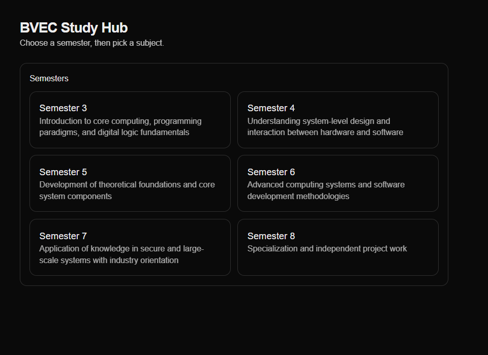
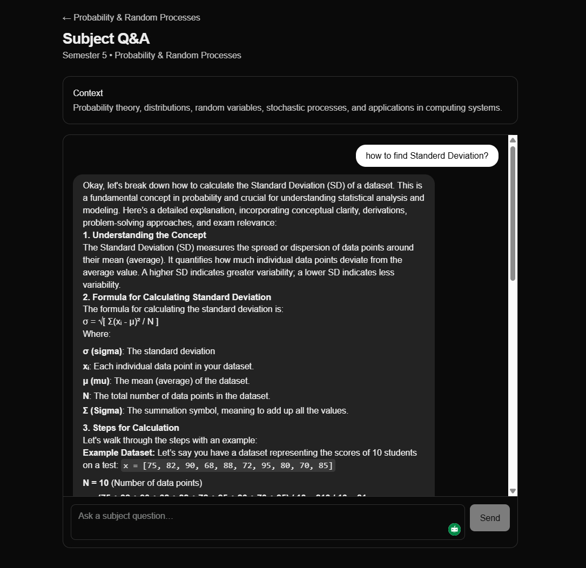
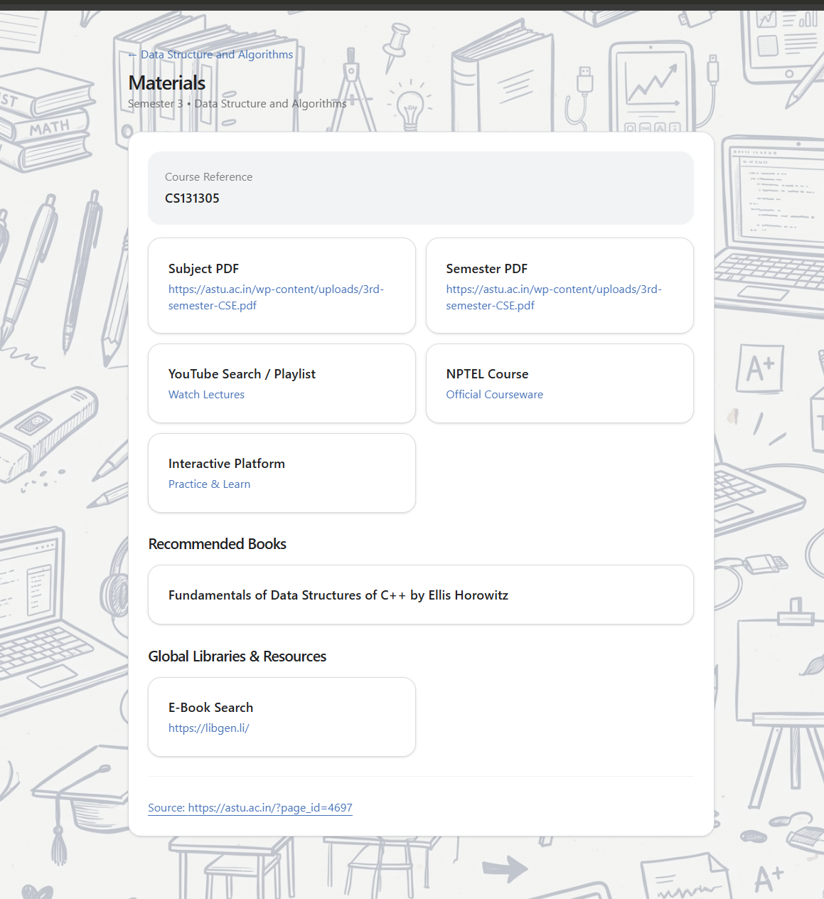

# Gemma — Local AI Study Chat (Next.js + LM Studio)

Gemma is a Next.js-based study assistant that connects to a locally hosted LM Studio server (OpenAI-compatible API). It provides a structured academic interface where users can navigate subjects and interact with a local language model for explanations, problem-solving, and code assistance.

> [!IMPORTANT]
> **To use the Chat functionality, you MUST install LM Studio locally.**
> The chat interface relies entirely on a local language model. You will need to download LM Studio, load a model of your choice, and set up your `.env` file to point to its local server. See the [Setup Instructions](#setup) for more details.

---

## Overview

Gemma is a specialized academic companion that transforms static syllabi into an interactive, localized learning environment. By combining an intuitive academic navigation system with local, AI-powered interactions, it allows students to seamlessly query complex topics, explore study materials, and receive on-demand explanations without relying on paid or cloud-based APIs.

**How it makes a difference:**
Traditional course management systems often present curriculums as rigid lists of subjects. This project bridges the gap by offering a dynamic, personalized study hub. It dynamically maps to diverse academic pathways—seamlessly supporting specialized subject types such as **project-based courses, hands-on lab components, specialized system tracks, and elective options**. This allows students to have a tailored, contextual AI assistant that truly understands their specific engineering or academic curriculum.

---

## Interface

### Study Hub

<p align="center">
  
</p>

The main entry point where users browse semesters and select subjects.

---

### Subject Q&A (Conceptual / Theory)

<p align="center">
  
</p>

Supports structured explanations for theoretical topics such as probability, statistics, and system concepts.

---

### Subject Q&A (Code / Technical)

<p align="center">
  
</p>

Handles technical responses including SQL schemas, formatted code blocks, and structured outputs.

---

## Features

* **Comprehensive Curriculum Mapping:** Dynamically adapts to diverse academic pathways, natively supporting regular subjects, lab components, electives, system tracks, and project-based coursework.
* **Contextual Study Materials:** Deep integration with learning resources, organizing module references, PDFs, and relevant academic context directly within each subject's dashboard.
* **Local-First AI Integration:** Fully integrated with LM Studio for secure, offline, and localized OpenAI-compatible model execution.
* **Advanced Content Rendering:** Beautiful, rich markdown rendering including code blocks with syntax highlighting and LaTeX-ready mathematical expressions.
* **Next.js App Router Architecture:** Blazing fast, client-side navigation built on top of modern Next.js paradigms.

---

## Tech Stack

* **Frontend:** Next.js, TypeScript, Tailwind CSS
* **Backend:** Next.js API routes
* **AI Runtime:** LM Studio (local models)
* **Rendering:** Markdown + syntax highlighting + math support

---

## Setup

> [!WARNING]
> The chat function **will not work** unless you have LM Studio running with the local server active.

### 1. Install and Start LM Studio

1. Download and install [LM Studio](https://lmstudio.ai/).
2. Open LM Studio and download a language model (e.g., `gemma-2b-it` or any model you prefer).
3. Go to the **Local Server** tab in LM Studio.
4. Load the model and click **Start Server** to enable the OpenAI-compatible server.

Default endpoint usually runs at:
```
http://localhost:1234/v1
```

---

### 2. Environment Configuration

Create a `.env` file in the root directory of this project and configure it with your LM Studio settings:

```env
LMSTUDIO_API_BASE_URL=http://localhost:1234/v1
# Replace with the exact model identifier you loaded in LM Studio
LMSTUDIO_MODEL=google/gemma-4-e4b
LMSTUDIO_API_KEY=not-needed
```

---

### 3. Install Dependencies

```bash
npm install
```

---

### 4. Run the Application

```bash
npm run dev
```

Open your browser and navigate to:

```
http://localhost:3000
```

---

## Project Structure

```
app/
  api/chat/        # Chat API route connecting to LM Studio
  components/      # UI components (ChatPanel, etc.)
  sem/             # Semester-based routing
lib/
  lmstudio.ts      # LM Studio integration utilities
  catalog.ts       # Academic utilities
public/
  images/          # Screenshots
  courses.json     # Course metadata
  materials.json   # Learning resources
```

---

## API

### POST /api/chat

* Proxies requests to your local LM Studio instance.
* Returns structured responses for rendering on the frontend.

---

## Notes

* Performance depends on your local hardware and the model size.
* Smaller models (2B–7B) are recommended for stability on standard machines.
* Proper Markdown rendering is required for the full UI experience.

---

## Future Improvements

* Streaming responses
* Enhanced math rendering
* Code block UX (copy, themes)
* Persistent chat sessions
* ERP-style academic system integration

---

## License

MIT License
